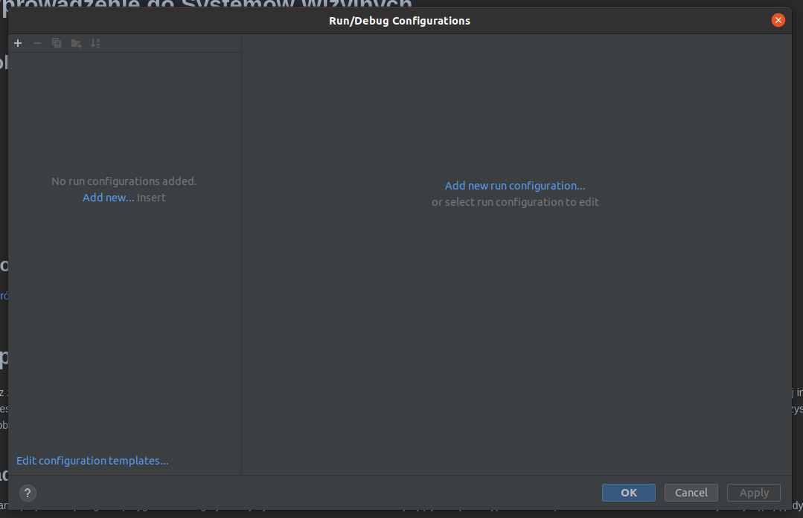
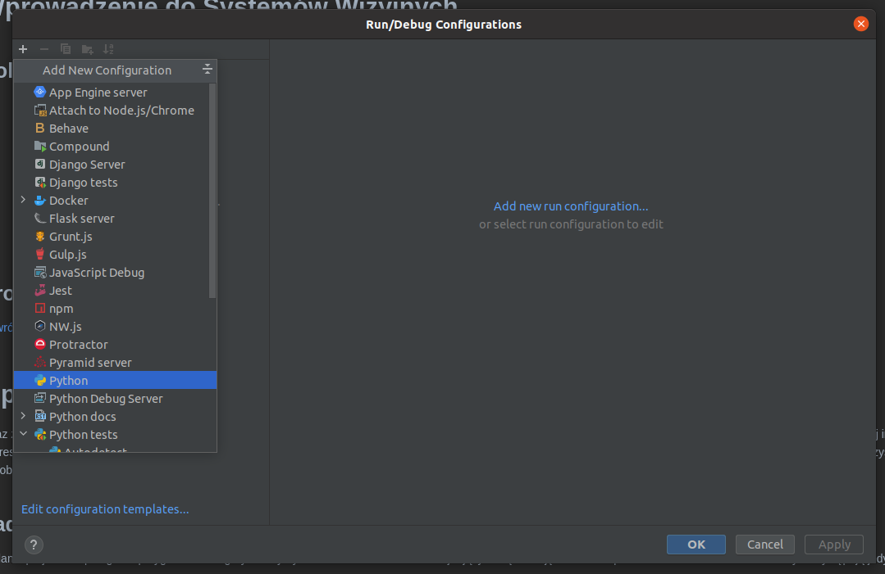
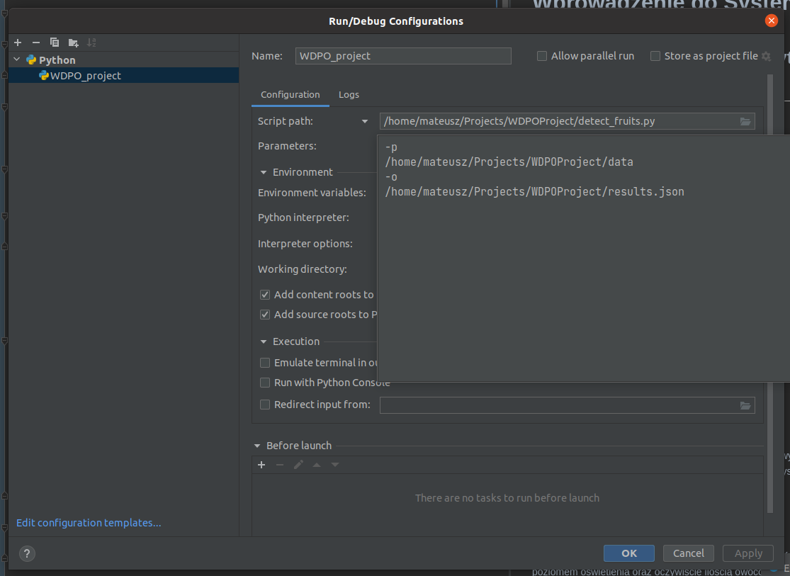

# Konfiguracja parametrów wejściowych skryptu w środowisku PyCharm 

W środowisku PyCharm możliwe jest dodanie parametrów wejściowych do skryptu, z którymi program będzie wywoływany każdorazowo przy uruchomieniu. W tym celu należy otworzyć okno konfiguracji z górnego menu `Run > Edit Configurations...`. W otwartym oknie konfiguracji poprzez symbol `+` należy dodać nową konfigurację dla języka Python. Tworzonej konfiguracji należy nadać nazwę, uzupełnić ścieżkę do pliku `detect.py` oraz uzupełnić ścieżki do parametrów wejściowych skryptu zgodnie z powyższym opisem oraz w sposób analogiczny jak na ostanim rysunku.

  

  

  

