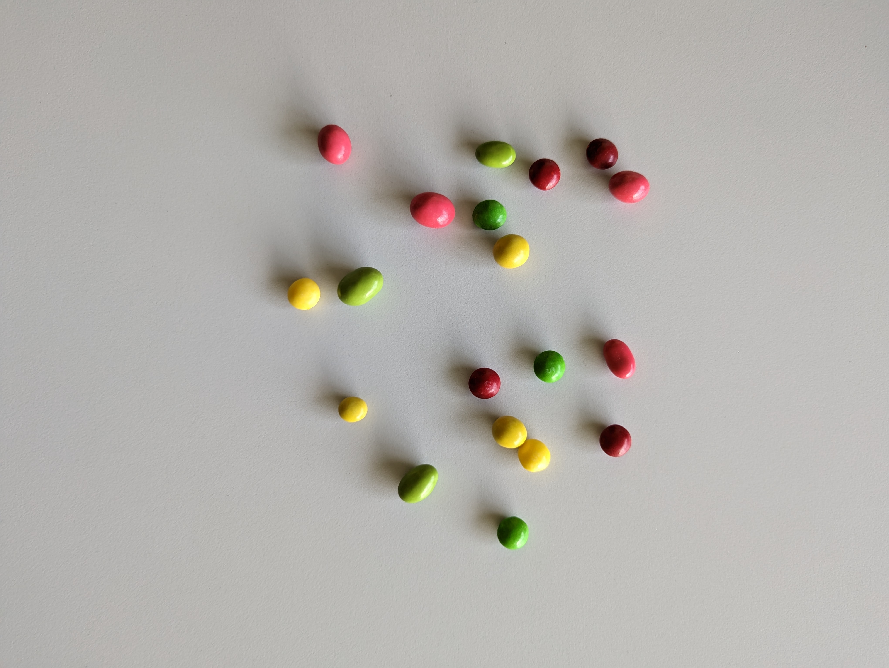
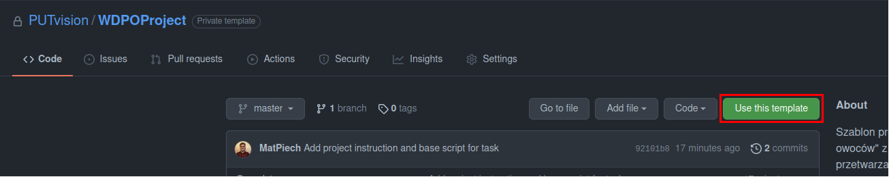
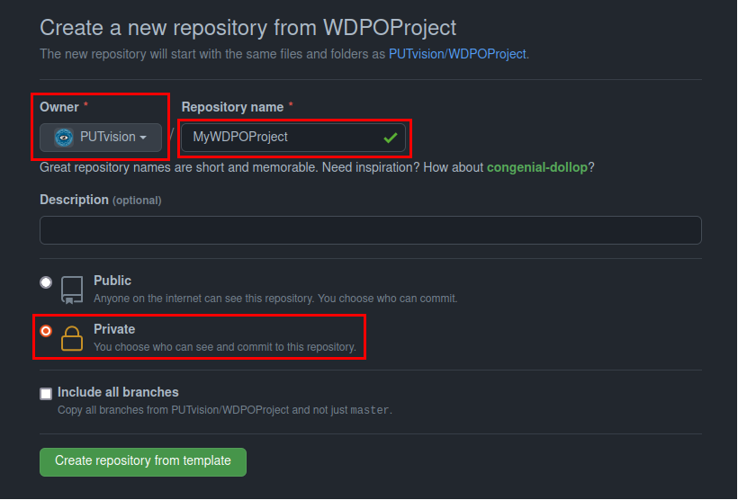
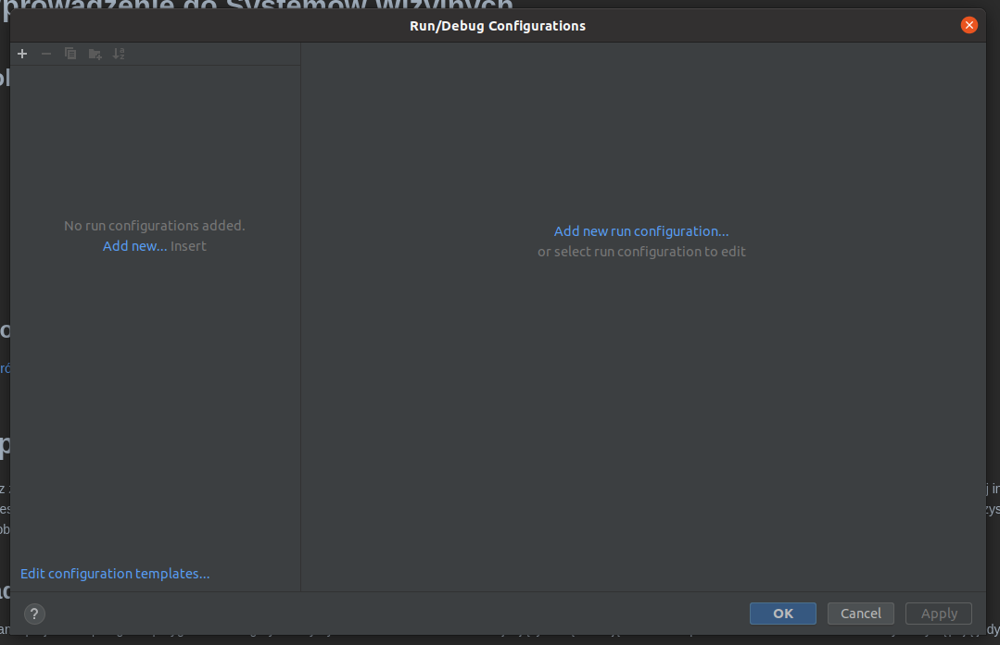
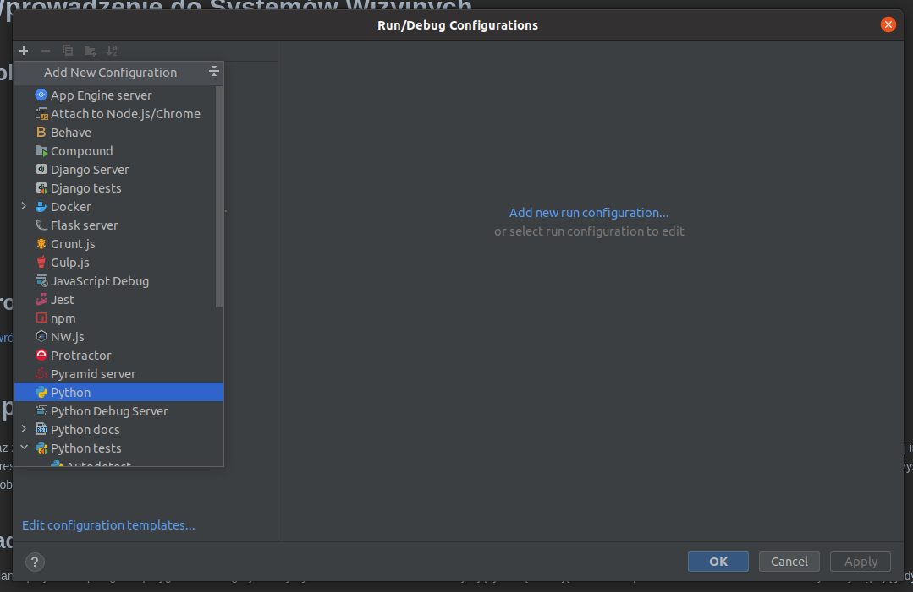
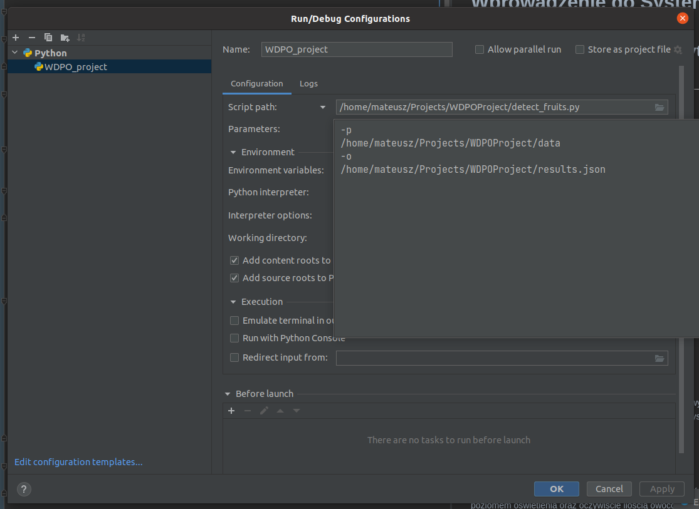

# Wprowadzenie do Systemów Wizyjnych

## Politechnika Poznańska, Instytut Robotyki i Inteligencji Maszynowej

<p align="center">
  
</p>

# **Projekt zaliczeniowy: zliczanie owoców**

Wraz z postępem technologicznym w obszarze sensorów wizyjnych wzrosło zapotrzebowanie na rozwiązania umożliwiające automatyzację procesów z wykorzystaniem wizyjnej informacji zwrotnej. Ponadto rozwój naukowy w zakresie algorytmów przetwarzania obrazu umożliwia wyciąganie ze zdjęć takich informacji jak ilość obiektów, ich rozmiar, położenie, a także orientacja. Jedną z aplikacji wykorzystujących przetwarzanie obrazu są na przykład bezobsługowe kasy pozwalające rozpoznać i zliczyć produkty, które znajdują się w koszyku.

## Zadanie

Zadanie projektowe polega na przygotowaniu algorytmu wykrywania i zliczania owoców znajdujących się na zdjęciach. Dla uproszczenia zadania w zbiorze danych występują jedynie 3 rodzaje owoców:
- jabłka
- banany
- pomarańcze

Wszystkie zdjęcia zostały zarejestrowane "z góry", ale z różnej wysokości. Ponadto obrazy różnią się między sobą poziomem oświetlenia oraz oczywiście ilością owoców.

Poniżej przedstawione zostało przykładowe zdjęcie ze zbioru danych i poprawny wynik detekcji dla niego:

```bash
{
  ...,
  "07.jpg": {
    "apple": 2,
    "banana": 1,
    "orange": 1
  },
  ...
}
```

<p align="center">
  
</p>

## Struktura projektu

Szablon projektu zliczania owoców na zdjęciach dostępny jest w serwisie [GitHub](https://github.com/PUTvision/WDPOProject) i ma następującą strukturę:

```bash
.
├── data
│   ├── 00.jpg
│   ├── 01.jpg
│   └── 02.jpg
├── readme_files
├── detect_fruits.py
├── README.md
└── requirements.txt
```

Katalog [`data`](./data) zawiera przykłady, na podstawie których w pliku [`detect_fruits.py`](./detect_fruits.py) przygotowany ma zostać algorytm zliczania owoców. Funkcja `main` w pliku `detect_fruits.py` powinna pozostać bez zmian. 

### Wykorzystanie szablonu

W przypadku chęci wykorzystania przygotowanego szablonu oraz systemu kontroli wersji w postaci serwisu GitHub możliwe jest stworzenie własnego repozytorium na podstawie szablonu. W tym celu należy poprzez przycisk `Use this template` utworzyć nowe repozytorium wybierając swoje konto jako właściciela, nadając mu własną nazwę i obowiązkowo ustawiając widzialność jako **prywatne**. Powyższe kroki zostały przedstawione na załączonych zdjęciach.

<p align="center">
  
</p>
<p align="center">
  
</p>

### Biblioteki

Interpreter testujący projekty będzie miał zainstalowane biblioteki:
- [OpenCV](https://docs.opencv.org/master/) w wersji 4.5.3.56
- [NumPy](https://numpy.org/) w wersji 1.19.5
- [Click](https://palletsprojects.com/p/click/) w wersji 7.1.2
- [tgdm](https://tqdm.github.io/) w wersji 4.62.3

Natomiast w przypadku wykorzystania w projekcie dodatkowych bibliotek należy przygotować plik `requirements.txt`, zawierający informacje o dodatkowym pakiecie i jego wersji, zgodnie z poniższym przykładem:

```bash
scikit-image==0.18.3
matplotlib
```

Więcej informacji na temat zastosowania plików `requirements.txt` można znaleźć w:
- [What is the python requirements.txt?](https://www.idkrtm.com/what-is-the-python-requirements-txt/)
- [Use requirements.txt](https://www.jetbrains.com/help/pycharm/managing-dependencies.html)

### Wywyołanie programu

Skrypt `detect_fruits.py` przyjmuje 2 parametry wejściowe:
- `data_path` - ścieżkę do folderu z danymi (zdjęciami)
- `output_file_path` - ścieżkę do pliku z wynikami

```bash
$ python3 detect_fruits.py --help

Options:
  -p, --data_path TEXT         Path to data directory
  -o, --output_file_path TEXT  Path to output file
  --help                       Show this message and exit.
```

W konsoli systemu Linux skrypt można wywołać z katalogu projektu w następujący sposób:

```bash
python3 detect_fruits.py -p ./data -o ./results.json
```

W środowisku PyCharm możliwe jest dodanie parametrów wejściowych do skryptu, z którymi program będzie wywoływany każdorazowo przy uruchomieniu. W tym celu należy otworzyć okno konfiguracji z górnego menu `Run > Edit Configurations...`. W otwartym oknie konfiguracji poprzez symbol `+` należy dodać nową konfigurację dla języka Python. Tworzonej konfiguracji należy nadać nazwę, uzupełnić ścieżkę do pliku `detect_fruits.py` oraz uzupełnić ścieżki do parametrów wejściowych skryptu zgodnie z powyższym opisem oraz ostanim rysunkiem.

<p align="center">
  
</p>
<p align="center">
  
</p>
<p align="center">
  
</p>

## Przesyłanie rozwiązania

Stworzone rozwiązanie należy skompresować do formatu `ZIP`, a wyjściowy plik nazwać numerem indeksu (np. 123456.zip). Zadanie to można przykładowo zrealizować w systemach Linux z wykorzystaniem komendy systemowej `zip` w terminalu tak, jak to zostało przedstawione poniżej:

```bash
zip <NUMER INDEKSU>.zip detect_fruits.py requirements.txt
```

Skompresowany plik należy wstawić w odpowiednim miejscu na platformie eKursy.

**Uwaga:** w pliku `.zip` powinien znajdować się jedynie bezpośrednio plik `detect_fruits.py` oraz opcjonalnie `requirements.txt`.

## Ewaluacja rozwiązań

Przesłane rozwiązania zostaną sprawdzone pod kątem plagiatu oraz z wykorzystaniem poniższego wzoru ocenione będzie działanie algorytmu zliczania owoców:  

<p align="center">
  
</p>

Gdzie:
-  oznacza liczbę obrazów
-  oznacza rzeczywistą ilość danego typu owoca
-  oznacza przewidzianą ilość danego typu owoca

Końcowy zbiór ewaluacyjny, na którym testowany będzie algorytm jest niepubliczny i niedostępny w czasie realizacji projektu. Przed końcowym terminem oddania projektu każdy student będzie miał możliwość maksymalnie raz sprawdzić działanie swojego algorytmu na zbiorze testowym (innym niż ewaluacyjny) poprzez przesłanie swojego rozwiązania we wskazanym, wcześniejszym terminie. Do dyspozycji studentów w całości dostępny jest zbiór treningowy dostępny w katalogu [data](./data/).


**Ostatnia edycja:** 26.10.2021
