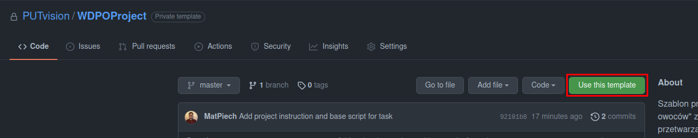
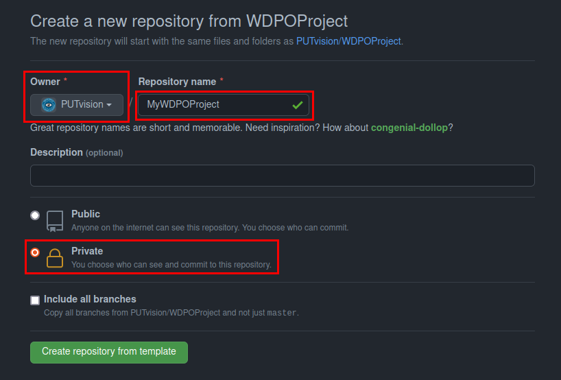

# Wprowadzenie do Systemów Wizyjnych

## Politechnika Poznańska, Instytut Robotyki i Inteligencji Maszynowej

<p align="center">
  
</p>


# **Projekt zaliczeniowy: zliczanie liści**

Wraz z postępem technologicznym w obszarze sensorów wizyjnych wzrosło zapotrzebowanie na rozwiązania umożliwiające automatyzację procesów z wykorzystaniem wizyjnej informacji zwrotnej. Ponadto rozwój naukowy w zakresie algorytmów przetwarzania obrazu umożliwia wyciąganie ze zdjęć takich informacji jak ilość obiektów, ich rozmiar, położenie, a także orientacja. Jedną z aplikacji wykorzystujących przetwarzanie obrazu jest automatyczna kontrola ilości obiektów na linii produkcyjnej wraz z rozróżnieniem ich klasy np. w celu ich sortowania w dalszym kroku. W ramach projektu zrealizowane zostanie zadanie wykrywanie i zliczanie liści.


## Changelog
**Ostatnia edycja:** 05.12.2023


## Zadanie

Zadanie projektowe polega na przygotowaniu algorytmu wykrywania i zliczania typów liści znajdujących się na zdjęciach. Dla uproszczenia zadania w zbiorze danych występuje jedynie 5 zróżnicowanych typów liści:
- topola osika (_ang. aspen_)
- brzoza (_ang. birch_)
- leszczyna (_ang. hazel_)
- klon (_ang. maple_)
- dąb (_ang. oak_)

Wszystkie zdjęcia zostały zarejestrowane "z góry", na jasnym tle. Niemniej jednak obrazy różnią się między sobą poziomem oświetlenia oraz wielkością i ilością liści.

Poniżej przedstawione zostało przykładowe zdjęcie ze zbioru danych i poprawny wynik detekcji dla niego:

```bash
{
  ...,
  "0037.jpg": {
    "aspen": 0,
    "birch": 1,
    "hazel": 4,
    "maple": 2,
    "oak": 2
  },
  ...
}
```

<p align="center">
  
</p>


## Struktura projektu

Szablon projektu zliczania liści na zdjęciach dostępny jest w serwisie [GitHub](https://github.com/PUTvision/WDPOProject) i ma następującą strukturę:

```bash
.
├── data
│   ├── 0000.jpg
│   ├── 0001.jpg
|   ├── ...
│   ├── 0049.jpg
│   └── train.json
├── check.py
├── detect.py
├── README.md
└── requirements.txt
```

Katalog [`data`](./data) zawiera przykłady, na podstawie których w pliku [`detect.py`](./detect.py) przygotowany ma zostać algorytm zliczania liści. Funkcja `main` w pliku `detect.py` powinna pozostać niezmieniona. Dodatkowo plik `train.json` zawiera informacje o ilości występujących liści dla każdego z obrazów, które można wykorzystać do porównania z otrzymanymi wynikami.


### Wykorzystanie szablonu

W przypadku chęci wykorzystania przygotowanego szablonu oraz systemu kontroli wersji w postaci serwisu GitHub możliwe jest stworzenie własnego repozytorium na podstawie szablonu. W tym celu należy poprzez przycisk `Use this template` utworzyć nowe repozytorium wybierając swoje konto jako właściciela, nadając mu własną nazwę i obowiązkowo ustawiając widzialność jako **prywatne**. Powyższe kroki zostały przedstawione na poniższych zdjęciach.

<p align="center">
  
</p>
<p align="center">
  
</p>


### Biblioteki

Interpreter testujący projekty będzie miał zainstalowane następujące biblioteki w wersjach:
- `click==8.1.7`
- `numpy==1.26.2`
- `opencv-python-headless==4.8.1.78`
- `scikit-image==0.22.0`
- `tqdm==4.66.1`

Powyższe biblioteki można zainstalować w następujący sposób:
```bash
# bezpośrednio
pip install numpy==1.26.2 opencv-python-headless==4.8.1.78 tqdm==4.66.1 click==8.1.7 scikit-image==0.22.0

# albo poprzez plik requirements.txt
pip install -r requirements.txt
```

Natomiast w przypadku wykorzystania w projekcie dodatkowych pakietów należy uzupełnić plik `requirements.txt` o dodatkowe biblioteki (w odpowiedniej wersji) zgodnie z poniższym przykładem:

```bash
matplotlib
Pillow==10.1.0
```

Więcej informacji na temat zastosowania plików `requirements.txt` można znaleźć w:
- [What is the python requirements.txt?](https://www.idkrtm.com/what-is-the-python-requirements-txt/)
- [Use requirements.txt](https://www.jetbrains.com/help/pycharm/managing-dependencies.html)


### Wywołanie programu

Skrypt `detect.py` przyjmuje 2 parametry wejściowe:
- `data_path` - ścieżkę do folderu z danymi (zdjęciami)
- `output_file_path` - ścieżkę do pliku z wynikami

```bash
$ python3 detect.py --help

Options:
  -p, --data_path TEXT         Path to data directory
  -o, --output_file_path TEXT  Path to output file
  --help                       Show this message and exit.
```

W konsoli systemu Linux skrypt można wywołać z katalogu projektu w następujący sposób:

```bash
python3 detect.py -p ./data/ -o ./results.json
```

Konfiguracja parametrów wejściowych skryptu w środowisku PyCharm została opisana w pliku [PyCharm_input_configuration.md](./PyCharm_input_configuration.md).


## Przesyłanie rozwiązania

Stworzone rozwiązanie należy skompresować do formatu `ZIP`, a wyjściowy plik nazwać numerem indeksu (np. 123456.zip). Zadanie to można przykładowo zrealizować w systemach Linux z wykorzystaniem komendy systemowej `zip` w terminalu tak, jak to zostało przedstawione poniżej:

```bash
zip <NUMER INDEKSU>.zip detect.py requirements.txt
```

Skompresowany plik należy wstawić w odpowiednim miejscu na platformie eKursy.

**Uwaga:** w pliku `.zip` powinien znajdować się jedynie bezpośrednio plik `detect.py` oraz opcjonalnie `requirements.txt`.


## Ewaluacja rozwiązań

Przesłane rozwiązania zostaną sprawdzone pod kątem plagiatu oraz z wykorzystaniem poniższego wzoru ocenione będzie działanie algorytmu zliczania liści:

<p align="center" style="background: white;">
  
</p>

Gdzie:
-  oznacza liczbę obrazów
-  oznacza rzeczywistą ilość liści danego typu
-  oznacza przewidzianą ilość liści danego typu

Końcowy zbiór ewaluacyjny, na którym testowany będzie algorytm jest niepubliczny i niedostępny w czasie realizacji projektu. Do dyspozycji studentów w całości dostępny jest zbiór treningowy dostępny w katalogu [data](./data).


## Automatyczna sprawdzarka

W celu weryfikacji wyników na zbiorze walidacyjnym uruchomiona została sprawdzarka z której można skorzystać wywołując skrypt `check.py`:

```shell
python3 check.py
```

Sprawdzarka zwraca wynik miary *MARPE* dla wykorzystanego zbioru lub wyjście z konsoli zawierające wiadomość błędu jaki wystąpił podczas uruchamiania skryptu. Sprawdzarka analzuje jedynie wyniki studentów zapisanych na kurs (w serwisie eKursy), dlatego w skrypcie [`check.py`](./check.py) należy ustawić swój numer indeksu. Z systemu sprawdzającego każdy student może skorzystać raz na 15 minut.
